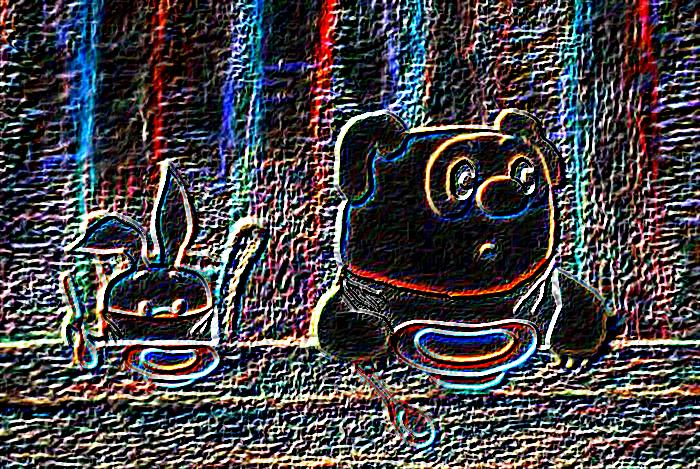

## Результат выполнения фильтров

##### Исходное изображение

### Точечные фильтры

###### 1. Инверсия

###### 2. Сепия

    
###### 3. Чёрно-белое

    
    
###### 4. Увеличивающий яркость

###### 5. Волны

###### 6. Эффект стекла

###### 7. В бинарное изображение

### Матричные фильтры

###### 1. Размытие

###### 2. Размытие по Гауссу

###### 3. Размытие с сдвигом

###### 4. Повышение резкости

###### 5. Выделение границ (Собель)

###### 6. Выделение границ (Щарра)

###### 7. Разница Собеля и Щарра

###### 8. Разница Щарра и Собеля

### Операции Морфологии

##### Исходное изображение

###### 1. Сужение

###### 2. Расширение

###### 3. Открытие

###### 4. Закрытие

